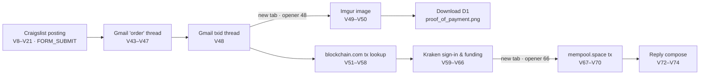

# SBT-DF204 — Case Study 2: Reconstructing Suspected Drug Trafficking From Chrome Web History

Forensic examination of a Chrome History SQLite database covering schema analysis, WebKit timestamp conversion, transition bit-field decoding and an evidence-based timeline across five correlated services.


---

## Author

| Field | Detail |
| :--- | :--- |
| **Student** | Ibrahim Diseh Garba |
| **Registration No.** | `2025/FWSD/11521` |
| **Programme** | Fellowship in Web Application Security & Digital Forensics |
| **Institution** | International Cybersecurity and Digital Forensics Academy (ICDFA) |
| **Course** | SBT-DF204 — Computer Forensics Case Studies |
| **Instructor** | Aminu Idris, AMCPN |
| **Batch** | BATCH-B2025 · L1/S2 |
| **Case reference** | `SBT-DF204-CS2-2025-FWSD-11521` |
| **Submission Date** | 9 October 2026 |

---

## Contents

1. [Overview](#overview)
2. [Objectives](#objectives)
3. [Environment](#environment)
4. [Methodology](#methodology)
5. [Key Findings](#key-findings)
6. [Analysis](#analysis)
7. [Evidence and Integrity](#evidence-and-integrity)
8. [Repository Structure](#repository-structure)
9. [Reproducing the Investigation](#reproducing-the-investigation)
10. [Challenges Encountered](#challenges-encountered)
11. [Recommendations](#recommendations)
12. [Safety and Ethics](#safety-and-ethics)
13. [References](#references)
14. [License](#license)

---

## Overview

This repository contains the forensic analysis of a Google Chrome History SQLite database (`History`) supplied for the **SBT-DF204 Case Study 2** investigation. The case hypothesis is that the browser was used to **advertise controlled drugs, communicate with an interested buyer, exchange payment information, verify a cryptocurrency transaction and retain proof of payment**.

The original database was preserved with SHA-256 verification. The analysis then enumerates the `urls`, `visits`, `downloads`, `downloads_url_chains`, `keyword_search_terms` and `visit_source` tables, converts WebKit timestamps to UTC and decodes navigation transition bit-fields. From these it reconstructs a timeline across five correlated services: Craigslist, Gmail, Imgur, blockchain.com and Kraken/mempool.space.

> **Scope note:** Chrome History records URLs, titles, timestamps, transitions and downloads. It does **not** record page content, the human operator or whether any transaction was completed in the real world. Conclusions are graded by confidence level accordingly.

---

## Objectives

1. Acquire and preserve the supplied Chrome History SQLite file with a documented SHA-256 and a verified read-only working copy.
2. Identify the relevant tables (`urls`, `visits`, `downloads`, `downloads_url_chains`) and their fields.
3. Convert Chrome WebKit timestamps to UTC using a documented, reproducible method.
4. Interpret navigation using transition core types, qualifier bits, and `from_visit` and `opener_visit` links.
5. Correlate posting, communication, payment-verification and download artefacts into a UTC timeline.
6. State a defensible conclusion with graded confidence, limitations and alternative explanations.

---

## Environment

| Component | Value |
| :--- | :--- |
| Operating System | Kali Linux (VMware) |
| Database Tool (CLI) | `sqlite3` 3.45.1, opened with `-readonly` |
| Database Tool (GUI) | DB Browser for SQLite (read-only mode) |
| Evidence Source | ICDFA E-Campus study material (SBT-DF204) |
| File Type | SQLite 3 database named `History` |
| Schema Version | 53 (last compatible 16) |
| File Size | 196,608 bytes (41 pages × 4,096 bytes) |
| Analysis Mode | Offline only; no live site contacted |

---

## Methodology

| Step | Action | SQL / Command |
| :---: | :--- | :--- |
| 1 | Verify integrity | `sha256sum` on original and working copy |
| 2 | Make original read-only | `chmod 444 evidence/History` |
| 3 | Create working copy | `cp evidence/History working/History_working` |
| 4 | List tables | `SELECT name FROM sqlite_master WHERE type='table'` |
| 5 | Inspect schemas | `PRAGMA table_info(urls)`, `visits`, `downloads` |
| 6 | Convert timestamps | `datetime(visit_time/1000000 + strftime('%s','1601-01-01'), 'unixepoch')` |
| 7 | Decode transitions | `transition & 0xFF` for core type; high bits for qualifiers |
| 8 | Walk navigation chains | Recursive `from_visit`; `opener_visit` for new tabs |
| 9 | Extract downloads | `downloads` joined with `downloads_url_chains` |
| 10 | Build timeline | `ORDER BY v.visit_time` |

### Timestamp Conversion Reference

Chrome stores timestamps as **microseconds since 1 January 1601 UTC** (the WebKit/Chromium epoch):

```sql
-- Whole seconds (integer division)
datetime(visit_time/1000000 + strftime('%s','1601-01-01'), 'unixepoch')

-- Sub-second precision (used for downloads)
strftime('%Y-%m-%d %H:%M:%f', start_time/1000000.0 - 11644473600, 'unixepoch')
```

### Transition Bit-Field Decoding

| Component | Value | Meaning |
| :--- | :--- | :--- |
| Core 0 | `LINK` | Followed a link or page-initiated navigation |
| Core 1 | `TYPED` | URL typed into the address bar |
| Core 5 | `GENERATED` | Omnibox-generated navigation |
| Core 7 | `FORM_SUBMIT` | Result of submitting a form |
| `0x02000000` | `FROM_ADDRESS_BAR` | Initiated from the address bar |
| `0x10000000` | `CHAIN_START` | First visit in a redirect chain |
| `0x20000000` | `CHAIN_END` | Last visit in a redirect chain |
| `0x40000000` | `CLIENT_REDIRECT` | Page-initiated redirect (script, meta refresh) |
| `0x80000000` | `SERVER_REDIRECT` | HTTP 3xx redirect |

---

## Key Findings

| Indicator | Value |
| :--- | :--- |
| Evidence file | `History` (SQLite 3 database) |
| File size | 196,608 bytes |
| SHA-256 | `b991b0fa69662c44caf599e468c8088576ebd9cebbf46d02c89cf51bcde3fd19` |
| Relevant tables | `urls`, `visits`, `downloads`, `downloads_url_chains` |
| Visit window (UTC) | 2022-04-19 13:54:18 → 15:02:56 (68 min 38 s) |
| Visit records | 74 |
| URL records | 57 |
| Download records | 1 (`proof_of_payment.png`) |
| Craigslist posting ID | `7473121658`, titled "cheaper than Rx supplements" (health and beauty) |
| Bitcoin transaction ID | `517b21569149…afdc5` |
| Gmail account displayed | `unsub.fscs@gmail.com` |
| Windows user folder | `FSCS_User` |
| Correlated services | Craigslist · Gmail · Imgur · blockchain.com · Kraken/mempool.space |
| Confidence (profile activity) | **High** |
| Confidence (sale/payment workflow) | **Moderate** |
| Confidence (controlled drugs) | **Low** |
| Confidence (human identity) | **Low** |

### Verdict

On 19 April 2022 the Chrome profile carried out a coherent 68-minute sequence:

1. It created a Craigslist posting.
2. It viewed Gmail threads linking that posting to an order and to a Bitcoin transaction.
3. It downloaded an image, saved as `proof_of_payment.png`.
4. It looked up the same transaction on two blockchain explorers, one of them reached from a Kraken funding page.

Two shared identifiers, the **posting ID** and the **transaction ID**, bind the records together across five services.

The record does **not** establish:
- what the advertisement offered or whether the goods were controlled substances;
- whether any email was sent;
- the value or direction of the transaction;
- who operated the browser.



---

## Analysis

### 1. Evidence Acquisition and Hash Verification

```bash
mkdir -p ~/SBT-DF204-CaseStudy2/{evidence,working,reports,screenshots,sql}
cd ~/SBT-DF204-CaseStudy2

# Copy original and make read-only
cp --preserve=timestamps /path/to/History evidence/History
chmod 444 evidence/History

# Create working copy
cp evidence/History working/History_working

# Hash both files
ls -l evidence/History
sha256sum evidence/History working/History_working | tee reports/01_acquisition.txt
```

**Result:** Both hashes match: `b991b0fa69662c44caf599e468c8088576ebd9cebbf46d02c89cf51bcde3fd19`

All SQL queries were run with `sqlite3 -readonly` so that the SQLite library could not create journal or WAL files.


*Figure 1: Size and SHA-256 of the read-only original and the working copy at acquisition.*


*Figure 2: Post-analysis SHA-256 values. Both files are unchanged, and no journal or WAL files were created.*

### 2. Database Schema

```bash
sqlite3 -readonly working/History_working "SELECT name FROM sqlite_master WHERE type='table' ORDER BY name;"
sqlite3 -readonly working/History_working "SELECT key, value FROM meta;"
sqlite3 -readonly -header -column working/History_working "PRAGMA table_info(urls);"
sqlite3 -readonly -header -column working/History_working "PRAGMA table_info(visits);"
sqlite3 -readonly -header -column working/History_working "PRAGMA table_info(downloads);"
sqlite3 -readonly -header -column working/History_working "PRAGMA table_info(downloads_url_chains);"
```

**Relevant tables and their roles:**

| Table | Rows | Role |
| :--- | :---: | :--- |
| `urls` | 57 | Unique URL: `id`, `url`, `title`, `visit_count`, `typed_count`, `last_visit_time` |
| `visits` | 74 | Navigation event: `id`, `url`, `visit_time`, `from_visit`, `transition`, `visit_duration`, `opener_visit` |
| `downloads` | 1 | Download: `target_path`, `start_time`, `received_bytes`, `state`, `mime_type` |
| `downloads_url_chains` | 1 | Redirect chain: `id`, `chain_index`, `url` |
| `keyword_search_terms` | 4 | Omnibox search terms linked to the search-result URL |
| `visit_source` | 0 | Empty, which is consistent with local browsing only |


*Figure 3: Table list, meta values (schema version 53) and row counts.*


*Figure 4: `PRAGMA table_info` for `urls`, `visits` and `downloads_url_chains`.*


*Figure 5: `PRAGMA table_info` for `downloads`.*

### 3. Visit Timeline (UTC)

```sql
SELECT v.id AS vid, u.id AS uid,
       datetime(v.visit_time/1000000 + strftime('%s','1601-01-01'),'unixepoch') AS visit_utc,
       v.from_visit AS from_v, v.opener_visit AS opener,
       printf('0x%08X', v.transition & 0xFFFFFFFF) AS trans_hex,
       v.transition & 0xFF AS core,
       round(v.visit_duration/1000000.0,1) AS dur_s,
       substr(u.title,1,44) AS title
FROM visits v JOIN urls u ON v.url = u.id
ORDER BY v.visit_time, v.id;
```

- **Time window:** 2022-04-19 13:54:18 → 15:02:56 UTC (68 min 38 s)
- **Local time (assumed EDT, UTC−4):** 09:54:18 → 11:02:56 on the same date. The device time zone is not recorded in History, so this is an assumption.


*Figure 6a: Visit timeline (UTC), visits 1–37.*


*Figure 6b: Visit timeline (UTC), visits 38–74.*

### 4. Navigation Transition Analysis

```sql
SELECT v.id AS vid, v.from_visit AS from_v,
       printf('0x%08X', v.transition & 0xFFFFFFFF) AS trans_hex,
       CASE v.transition & 0xFF WHEN 0 THEN 'LINK' WHEN 1 THEN 'TYPED'
         WHEN 5 THEN 'GENERATED' WHEN 7 THEN 'FORM_SUBMIT' WHEN 8 THEN 'RELOAD'
         ELSE 'OTHER' END AS core,
       trim(
        CASE WHEN v.transition & 0x02000000 THEN 'FROM_ADDRESS_BAR ' ELSE '' END ||
        CASE WHEN v.transition & 0x10000000 THEN 'CHAIN_START ' ELSE '' END ||
        CASE WHEN v.transition & 0x20000000 THEN 'CHAIN_END ' ELSE '' END ||
        CASE WHEN v.transition & 0x40000000 THEN 'CLIENT_REDIRECT ' ELSE '' END ||
        CASE WHEN (v.transition & 0xFFFFFFFF) & 0x80000000 THEN 'SERVER_REDIRECT' ELSE '' END) AS qualifiers,
       substr(u.url,1,58) AS url
FROM visits v JOIN urls u ON v.url = u.id
ORDER BY v.visit_time, v.id;
```

**Transition values observed:**

| Hex | Core | Qualifiers | n | Visit IDs |
| :--- | :--- | :--- | :---: | :--- |
| `0x30000000` | LINK | CHAIN_START \| CHAIN_END | 21 | 2, 20, 21, 23, 34–36, 47, 52–54, 57, 58, 60–66, 71 |
| `0x80000000` | LINK | SERVER_REDIRECT (mid-chain) | 13 | 4, 12, 25–29, 32, 38–41, 69 |
| `0x10000000` | LINK | CHAIN_START | 12 | 3, 6, 9, 11, 24, 31, 37, 43, 48, 49, 55, 67 |
| `0xA0000000` | LINK | SERVER_REDIRECT \| CHAIN_END | 9 | 5, 7, 10, 13, 30, 33, 50, 56, 70 |
| `0x30000007` | FORM_SUBMIT | CHAIN_START \| CHAIN_END | 7 | 8, 14–19 |
| `0x40000000` | LINK | CLIENT_REDIRECT | 5 | 44, 45, 68, 72, 73 |
| `0x60000000` | LINK | CLIENT_REDIRECT \| CHAIN_END | 3 | 42, 46, 74 |
| `0x32000005` | GENERATED | FROM_ADDRESS_BAR \| CHAIN_START \| CHAIN_END | 3 | 22, 51, 59 |
| `0x30000005` | GENERATED | CHAIN_START \| CHAIN_END | 1 | 1 |

**Key observations:**

- **No typed navigation.** Every `urls.typed_count` is 0, and no visit has core type 1.
- **Four omnibox searches** are recorded: `craigslist`, `gmail`, `blockchain explorer` and `kraken`.
- **Seven form submissions**, all in the Craigslist login and posting workflow.
- **Redirect chains** show the server choosing the region (`geo.craigslist.org` → `baltimore.craigslist.org`) and show the Gmail-wrapped outbound links.


*Figure 7a: Decoded transition core types and qualifiers, visits 1–37.*


*Figure 7b: Decoded transition core types and qualifiers, visits 38–74.*


*Figure 13: `keyword_search_terms` joined to `urls`.*


*Figure 15: Typed-navigation check and first/last visit times.*


*Figure 17: Frequency of each transition value present in the capture.*

### 5. Craigslist Posting Workflow

```sql
SELECT v.id AS vid, u.id AS uid,
       datetime(v.visit_time/1000000 + strftime('%s','1601-01-01'),'unixepoch') AS visit_utc,
       v.from_visit AS from_v, v.transition & 0xFF AS core,
       round(v.visit_duration/1000000.0,1) AS dur_s,
       substr(u.title,1,40) AS title,
       substr(u.url, instr(u.url,'://')+3, 62) AS url
FROM visits v JOIN urls u ON v.url = u.id
WHERE u.url LIKE '%craigslist.org%'
ORDER BY v.visit_time, v.id;
```

**Posting workflow stages:**

| Stage | Visit | UTC | Transition | Title / URL |
| :--- | :---: | :--- | :--- | :--- |
| Login page | 6–7 | 13:54:22 | LINK → redirect | `accounts.craigslist.org/login` |
| Login form submit | 8 | 13:54:39 | `0x30000007` | `login/home` |
| Posting session created | 11–13 | 13:55:05 | Link + redirects | `post.craigslist.org/k/…/bQTi5` |
| Category selected | 14 | 13:55:10 | `0x30000007` | `?s=cat` |
| Listing composed (177.7 s) | 15 | 13:55:15 | `0x30000007` | `?s=edit` |
| Map added | 16 | 13:58:13 | `0x30000007` | `?s=geoverify` |
| Image step | 17 | 13:58:17 | `0x30000007` | `?s=editimage` |
| Preview | 18 | 13:58:19 | `0x30000007` | `?s=preview` |
| Confirmation | 19 | 13:58:22 | `0x30000007` | Posting confirmation |
| Manage posting | 20 | 13:58:27 | LINK | `/manage/7473121658` |
| Public listing | 21 | 13:58:31 | LINK (opener 20) | "cheaper than Rx supplements" (`hab`) |


*Figure 8: Craigslist sign-in and posting workflow, visits 3–21.*


*Figure 14: Recursive `from_visit` walk for visit 20 (posting) and visit 70 (mempool).*

### 6. Gmail Communication

```sql
SELECT v.id AS vid, u.id AS uid,
       datetime(v.visit_time/1000000 + strftime('%s','1601-01-01'),'unixepoch') AS visit_utc,
       v.from_visit AS from_v, v.opener_visit AS opener,
       printf('0x%08X', v.transition & 0xFFFFFFFF) AS trans_hex,
       substr(u.title,1,52) AS title,
       CASE WHEN u.url LIKE '%compose=%' THEN 'compose-state'
            WHEN u.url LIKE '%#inbox/%' THEN 'thread-view'
            WHEN u.url LIKE '%#inbox' THEN 'inbox' END AS view
FROM visits v JOIN urls u ON v.url = u.id
WHERE u.url LIKE 'https://mail.google.com/mail/u/0/#inbox%'
ORDER BY v.visit_time, v.id;
```

**Case-relevant Gmail thread views:**

| Visit | UTC | Thread ID prefix | Title (abridged) / View |
| :---: | :--- | :--- | :--- |
| 43 | 14:04:12 | A: `WhctKKXXDrfCqXBG` | "cheaper than Rx supplements - order" |
| 44, 45 | 14:04:35, 14:04:46 | A | Two compose states |
| 46, 47 | 14:04:52, 14:05:59 | A → inbox | Return to thread, then inbox |
| 48 | 14:56:47 | B: `WhctKKXXDrfCqvtR` | "cheaper than Rx supplements -- txid: 517b21569149…" |
| 72, 73 | 15:02:32, 15:02:44 | B | Two compose states |
| 74 | 15:02:56 | B | Return to thread (last visit) |

**Account displayed:** `unsub.fscs@gmail.com`, taken from page titles beginning at visit 25. The compose-state URLs show only that a compose window was opened. They do not prove a message was sent.


*Figure 9: Gmail inbox, thread and compose views with thread-ID prefixes.*

### 7. Imgur, Blockchain Explorer and Kraken Correlation

```sql
SELECT v.id AS vid, u.id AS uid,
       datetime(v.visit_time/1000000 + strftime('%s','1601-01-01'),'unixepoch') AS visit_utc,
       v.from_visit AS from_v, v.opener_visit AS opener,
       printf('0x%08X', v.transition & 0xFFFFFFFF) AS trans_hex,
       substr(u.title,1,40) AS title,
       substr(u.url, instr(u.url,'://')+3, 60) AS url
FROM visits v JOIN urls u ON v.url = u.id
WHERE u.url LIKE '%imgur%' OR u.url LIKE '%blockchain.com%'
   OR u.url LIKE '%kraken.com%' OR u.url LIKE '%mempool.space%'
ORDER BY v.visit_time, v.id;
```

**Transaction ID correlation across services:**

| Visit | UTC | Site | How reached |
| :---: | :--- | :--- | :--- |
| 48 | 14:56:47 | Gmail | Thread opened from inbox (txid in title) |
| 49–50 | 14:56:52 | Imgur | Gmail-wrapped link, new tab (opener 48) → `imgur.com/dTgrkP7` |
| 55–57 | 14:59:06 | blockchain.com | Search → server redirect to tx page |
| 58 | 14:59:21 | blockchain.com | Address `38RcsURWCDmCbYocmsZCnGz1FtD7x477mt` |
| 61–63 | 14:59:47–15:00:21 | kraken.com | Sign-in; new-device approval |
| 64–66 | 15:01:11–15:01:21 | kraken.com | Trade, instant and funding pages |
| 67–70 | 15:01:31–15:01:33 | kraken.com → mempool.space | From funding page (opener 66) via redirect |
| 71 | 15:02:05 | kraken.com | History – Ledger page |


*Figure 10: Imgur, blockchain.com, Kraken and mempool.space visits.*


*Figure 11: Every visit whose URL or title contains the transaction ID.*

### 8. Download Record

```sql
SELECT d.id, d.target_path,
       strftime('%Y-%m-%d %H:%M:%f', d.start_time/1000000.0 - 11644473600,'unixepoch') AS start_utc,
       strftime('%Y-%m-%d %H:%M:%f', d.end_time/1000000.0 - 11644473600,'unixepoch') AS end_utc,
       d.received_bytes AS rcvd, d.total_bytes AS total, d.state, d.danger_type AS danger,
       d.opened, d.mime_type, d.referrer, d.tab_url, d.last_modified,
       c.chain_index, c.url AS chain_url
FROM downloads d LEFT JOIN downloads_url_chains c ON c.id = d.id
ORDER BY d.start_time;
```

| Field | Value |
| :--- | :--- |
| `downloads.id` | 1 |
| `target_path` | `C:\Users\FSCS_User\Desktop\proof_of_payment.png` |
| Source URL | `https://i.imgur.com/dTgrkP7.png` |
| Start → End (UTC) | 14:56:58.494 → 14:57:10.261 |
| Received / Total | 33,844 / 33,844 bytes (complete) |
| State / Danger | 1 (complete) / 0 (not dangerous) |
| MIME type | `image/png` |
| Opened | 0 (not opened through Chrome) |

The saved name `proof_of_payment.png` differs from the server name `dTgrkP7.png`, which suggests the file was deliberately labelled when it was saved.


*Figure 12: Download record joined to `downloads_url_chains`, with sub-second UTC times.*

### 9. Timeline (Summary, UTC)

| # | UTC (19 Apr 2022) | Records | Stage |
| :---: | :--- | :--- | :--- |
| 1 | 13:54:18–13:54:19 | V1–5 | Reach Craigslist (omnibox search; redirect to Baltimore) |
| 2 | 13:54:22–13:54:39 | V6–8 | Account sign-in (form submission) |
| 3 | 13:55:03–13:58:22 | V9–19 | Create posting (six form submissions) |
| 4 | 13:58:27–13:58:31 | V20–21 | Manage and view posting 7473121658 |
| 5 | 13:58:38–13:59:31 | V22–42 | Gmail sign-in (password challenge) |
| 6 | 14:04:12–14:05:59 | V43–47 | "Order" thread viewed; compose states |
| — | 14:05:59–14:56:47 | — | Gap: 50 min 48 s with no recorded activity |
| 7 | 14:56:47 | V48 | Transaction thread (txid in title) |
| 8 | 14:56:52 | V49–50 | Image link → `imgur.com/dTgrkP7` |
| 9 | 14:56:58–14:57:10 | D1 | Download of `proof_of_payment.png`, 33,844 bytes |
| 10 | 14:58:59–14:59:06 | V51–57 | blockchain.com search → tx page |
| 11 | 14:59:21 | V58 | Address `38Rcs…477mt` viewed |
| 12 | 14:59:38–15:00:21 | V59–63 | Kraken sign-in; new-device approval |
| 13 | 15:01:11–15:01:21 | V64–66 | Trade, instant and funding pages |
| 14 | 15:01:31–15:01:33 | V67–70 | Kraken redirect → mempool.space tx page |
| 15 | 15:02:05 | V71 | Kraken History – Ledger |
| 16 | 15:02:32–15:02:56 | V72–74 | Reply compose; last visit |

The full record-by-record timeline is in [`reports/q04_timeline.txt`](reports/q04_timeline.txt) and Appendix 12.2 of the report.

---

## Evidence and Integrity

| File | Description |
| :--- | :--- |
| `evidence/History` | Original database (read-only, `chmod 444`; not committed) |
| `working/History_working` | Hash-verified analysis copy (not committed) |
| `reports/01_acquisition.txt` | Acquisition hash verification |
| `reports/99_final_hashes.txt` | Post-analysis hash verification |
| `reports/02_tables.txt` | Table list, meta values and row counts |
| `reports/03_schema.txt`, `03b_schema_downloads.txt` | Table schemas |
| `reports/q04_timeline.txt` | Full visit timeline in UTC |
| `reports/q05_transitions.txt` | Transition bit-field decoding |
| `reports/q10_downloads.txt` | Download with URL chain |
| `reports/q14_integrity.txt` | ID contiguity and free-page checks |
| `sql/q04–q15*.sql` | Saved analytical SQL queries (Q01–Q03 are inline schema commands) |

### Chain of Custody

| Field | Value |
| :--- | :--- |
| Case ID | `SBT-DF204-CS2-2025-FWSD-11521` |
| Analyst | Ibrahim Diseh Garba |
| Registration No. | `2025/FWSD/11521` |
| Evidence item | Chrome History SQLite database |
| Original SHA-256 | `b991b0fa69662c44caf599e468c8088576ebd9cebbf46d02c89cf51bcde3fd19` |
| Working-copy SHA-256 | Identical at creation and after analysis |
| Read-only enforcement | `sqlite3 -readonly`; `chmod 444` on the original |
| Storage | Original in `evidence/`; working copy in `working/`; SQL in `sql/`; outputs in `reports/` |
| Handling notes | No live URL, account, wallet or transaction ID accessed. Session tokens truncated in figures. |


*Figure 16: Record-ID contiguity, `sqlite_sequence` and free-page count.*

---

## Repository Structure

```text
SBT-DF204-CaseStudy2/
├── README.md
├── SBTDF204_CaseStudy2_2025-FWSD-11521.pdf
├── .gitignore
│
├── evidence/                     (not committed)
│   └── History
├── working/                      (not committed)
│   └── History_working
├── sql/
│   ├── q04_timeline.sql
│   ├── q05_transitions.sql
│   ├── q06_posting.sql
│   ├── q07_gmail.sql
│   ├── q08_payment.sql
│   ├── q09_txid.sql
│   ├── q10_downloads.sql
│   ├── q11_searches.sql
│   ├── q12_chain.sql
│   ├── q13_typed.sql
│   ├── q14_integrity.sql
│   └── q15_transition_counts.sql
├── reports/
│   ├── 01_acquisition.txt
│   ├── 02_tables.txt
│   ├── 03_schema.txt
│   ├── 03b_schema_downloads.txt
│   ├── q04_timeline.txt … q15_transition_counts.txt
│   └── 99_final_hashes.txt
└── screenshots/
    ├── fig01_acquisition_hash.png
    ├── fig02_tables_meta.png
    ├── fig03_schema_urls_visits.png
    ├── fig04_schema_downloads.png
    ├── fig05a_timeline_1-37.png
    ├── fig05b_timeline_38-74.png
    ├── fig06a_transitions_1-37.png
    ├── fig06b_transitions_38-74.png
    ├── fig07_posting_workflow.png
    ├── fig08_gmail_threads.png
    ├── fig09_imgur_blockchain_kraken.png
    ├── fig10_txid_correlation.png
    ├── fig11_download_record.png
    ├── fig12_search_terms.png
    ├── fig13_from_visit_chains.png
    ├── fig14_typed_and_window.png
    ├── fig15_final_hashes.png
    ├── fig16_integrity_checks.png
    └── fig17_transition_counts.png
```

Add a `.gitignore` so the evidence database is never committed:

```gitignore
evidence/
working/
History
History_working
*-journal
*-wal
*-shm
```

---

## Reproducing the Investigation

### Setup

```bash
git clone https://github.com/Braixtech/SBT-DF204-CaseStudy2.git
cd SBT-DF204-CaseStudy2
mkdir -p evidence working reports
```

### Acquire and Verify

```bash
cp /path/to/E-Campus/History evidence/History
chmod 444 evidence/History
cp evidence/History working/History_working
sha256sum evidence/History working/History_working | tee reports/01_acquisition.txt
```

If your hash does not match `b991b0fa…3fd19`, you have a different file and the findings above may not apply.

### Examine the Schema

```bash
sqlite3 -readonly working/History_working ".tables"
sqlite3 -readonly -header -column working/History_working "PRAGMA table_info(urls);"
sqlite3 -readonly -header -column working/History_working "PRAGMA table_info(visits);"
sqlite3 -readonly -header -column working/History_working "PRAGMA table_info(downloads);"
sqlite3 -readonly -header -column working/History_working "PRAGMA table_info(downloads_url_chains);"
```

### Run All Saved Queries

```bash
for f in sql/q*.sql; do
  n=$(basename "$f" .sql)
  sqlite3 -readonly -header -column working/History_working < "$f" > "reports/$n.txt"
done
```

### Reconstruct the Timeline (UTC)

```sql
SELECT v.id AS visit_id, u.id AS url_id, u.url, u.title,
       datetime(v.visit_time/1000000 + strftime('%s','1601-01-01'), 'unixepoch') AS visit_utc,
       v.from_visit, v.transition, v.transition & 0xFF AS core,
       v.visit_duration/1000000.0 AS duration_s
FROM visits v JOIN urls u ON v.url = u.id
ORDER BY v.visit_time;
```

### Extract Downloads

```sql
SELECT d.id, d.target_path,
       strftime('%Y-%m-%d %H:%M:%f', d.start_time/1000000.0 - 11644473600, 'unixepoch') AS start_utc,
       d.received_bytes, d.total_bytes, d.state, d.mime_type,
       c.chain_index, c.url
FROM downloads d LEFT JOIN downloads_url_chains c ON d.id = c.id
ORDER BY d.start_time;
```

### Verify Integrity After Analysis

```bash
sha256sum evidence/History working/History_working | tee reports/99_final_hashes.txt
```

---

## Challenges Encountered

### Environment and Technical Challenges

| Challenge | Resolution |
| :--- | :--- |
| Negative transition values in SQLite (e.g., −2147483648) | Masked with `transition & 0xFFFFFFFF` before hex display; decoded qualifiers bit by bit |
| Paired GENERATED/LINK visits for each omnibox search | Recorded as an observed artefact linked by `opener_visit`; not counted as two searches |
| Visits with `from_visit = 0` that continued a workflow | Used `opener_visit` to identify links opened in new tabs (visits 21, 49, 67) |
| Gmail is a single-page application | Interpreted CLIENT_REDIRECT chains as view changes; distinguished threads by URL thread-ID prefix |
| Integer division truncated sub-second time | Used floating-point division for the download record; cross-checked in Python |
| Very long authentication URLs in figures | Truncated output columns; retained only case-relevant identifiers |
| No device time zone in History | Kept UTC as the reference; local time shown separately and labelled as an assumption |

### Evidence Integrity

- Original database preserved read-only with `chmod 444`.
- All queries executed with `sqlite3 -readonly`, so no journal or WAL files could be created.
- SHA-256 identical before and after analysis.
- `PRAGMA freelist_count` returned 0, so there are no free pages in which deleted records could survive.
- Visit IDs (1–74) and URL IDs (1–57) are contiguous, which is consistent with no deletions within the window.

---

## Recommendations

### Further Investigative Steps

| Action | Purpose |
| :--- | :--- |
| Examine the full Chrome profile (Login Data, Web Data, Cookies, Sessions, Cache) | Recover autofill, session state and cached content |
| Correlate Windows Security event logs with 13:54–15:03 UTC on 19 Apr 2022 | Link browser activity to an authenticated user session |
| Seek Craigslist records for posting 7473121658 (lawful process) | Obtain the advertisement text, images and poster account |
| Seek Google records for `unsub.fscs@gmail.com` (threads A and B) | Establish message content, sender and recipient |
| Seek Kraken records for the account signed in at 14:59–15:02 UTC | Confirm whether the txid was a deposit to that account |
| Locate and hash `proof_of_payment.png` on the device | Verify file content and integrity |
| Trace the transaction and address `38Rcs…477mt` with offline blockchain analytics | Establish the flow of funds |

### Examination Practice

- Open SQLite evidence in read-only mode and hash it before and after analysis, because routine opening can create journal files or modify pages.
- Enumerate the schema and `meta.version` before querying. Field sets differ between Chrome versions; for example, `opener_visit` is absent in older schemas.
- Decode the full transition bit-field and read it together with `from_visit`, `opener_visit`, URLs and titles. The core type alone can mislead in single-page applications.
- Report UTC as the reference time. Label any local-time conversion as an assumption unless the operating system establishes the device time zone.
- Corroborate History findings with a second tool (e.g., Hindsight) to guard against single-tool error.

---

## Safety and Ethics

- This case study was conducted exclusively offline against the supplied training database.
- No live website, posting, email account, image link, exchange, wallet, address or transaction identifier referenced in the history was contacted or interacted with.
- No real person outside the training scenario was identified or accused.
- Unrelated personal data, including Google sign-in parameters (`TL=`, `sidt=`, `osidt=`), was truncated from figures. Case-relevant identifiers (Gmail address, posting ID, transaction ID and Windows profile folder) were retained so the examiner can verify each finding.
- The original database was preserved read-only, and all analysis was performed on a hash-verified working copy.

> **Warning:** Chrome History analysis is a forensic technique intended for authorised investigation only. Do not use these techniques against systems or accounts you are not explicitly authorised to examine. Do not visit or interact with any live URL, account, exchange or wallet referenced in forensic evidence.

---

## References

- Casey, E. (2011). *Digital evidence and computer crime: Forensic science, computers and the Internet* (3rd ed.). Academic Press.
- Chromium Authors. (n.d.). *page_transition_types.h* [Source code]. Chromium. https://source.chromium.org/chromium/chromium/src/+/main:ui/base/page_transition_types.h
- Forensic Science Regulator. (2023). *Forensic science regulator code of practice*. UK Government.
- International Cybersecurity and Digital Forensics Academy. (2026). *SBT-DF204 Computer forensics case studies: Case study 2 student assessment brief* [Unpublished course material]. ICDFA E-Campus.
- International Organization for Standardization & International Electrotechnical Commission. (2012). *Guidelines for identification, collection, acquisition and preservation of digital evidence* (ISO/IEC 27037:2012).
- International Organization for Standardization & International Electrotechnical Commission. (2015). *Guidelines for the analysis and interpretation of digital evidence* (ISO/IEC 27042:2015).
- Kent, K., Chevalier, S., Grance, T., & Dang, H. (2006). *Guide to integrating forensic techniques into incident response* (NIST SP 800-86). National Institute of Standards and Technology. https://doi.org/10.6028/NIST.SP.800-86
- Obsidian Forensics. (n.d.). *Hindsight: Web browser forensics for Google Chrome/Chromium* [Computer software]. https://github.com/obsidianforensics/hindsight
- SQLite. (n.d.-a). *Date and time functions*. https://www.sqlite.org/lang_datefunc.html
- SQLite. (n.d.-b). *Command line shell for SQLite*. https://www.sqlite.org/cli.html
- Xu, F. (n.d.). *digital-forensics-lab* [GitHub repository]. https://github.com/frankwxu/digital-forensics-lab

---

## License

Submitted as academic coursework for SBT-DF204 Case Study 2 at ICDFA. Contents may not be redistributed, reused or reproduced without written permission from the author and ICDFA.

© 2026 Ibrahim Diseh Garba. All rights reserved.
